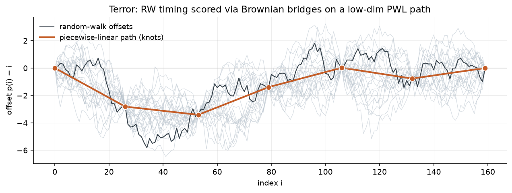
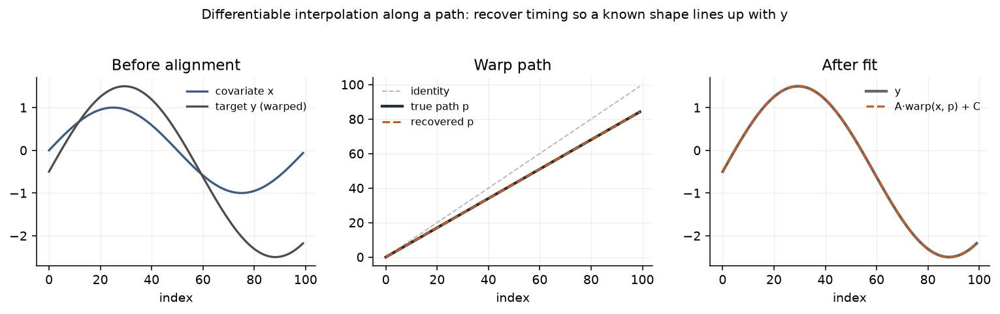

# warp_regression

Likelihood-based time warping for regression and forecasting on **cyclical** and **warped** series — including variable-duration response shapes (e.g. adstocked media effects).

Motivation and modelling basis: [`blog_post.md`](blog_post.md).

---

## What is warp regression?

Most ML sticks to **$y$-axis** error. Real timing mistakes are often about *when*: a train ten minutes late, a parcel a day after the promised window. Errors-in-variables already puts noise on inputs; warp regression asks whether **time** error can sit in a regression model explicitly, instead of being dumped into the residual on $y$.

That matters for **warped** or **cyclical** series (irregular phase — not the same as seasonality). Dynamic time warping is common, but it is mainly pattern matching: it does not easily give regression, inference, or forecasts of future timing. The bet here is a **generative** warp: an input series $x$ is deformed by slow expansions and contractions; we score that deformation with its own likelihood (**terror** = *t*iming *error*), and fit it jointly with ordinary observation error.

At each index $i$,

$$
\hat{y}_i = f\big(\mathrm{warp}(x, p)_i\big),
$$

where $x$ is a covariate (often a sine or other known shape), $p$ is a low-dimensional warp path (fractional indices into $x$), and $f$ is linear, an MLP, trend + cycle, …. **Soft-warp** here means ordinary differentiable linear interpolation of $x$ at those indices (standard technique — same family as spatial transformers / `grid_sample`; not invented in this package). What *is* specific here is scoring the path with a generative **terror** likelihood and fitting it jointly with the observation model.

### Terror (timing error)

Timing is modelled as a **Gaussian random walk** on path offsets — not the only option, but a simple generative way to let the series drift early and late, with scale $\sigma_t$. A free random walk at every index is infeasible (jagged, one parameter per observation). So the fitted path is **piecewise linear through $K \ll n$ knots**. Terror is the **expected log-likelihood of a Brownian bridge** on each knot segment (`expected_likelihood`): $O(K)$, autograd-friendly, and still tied to the RW story used for forecast path sampling.

Training uses a **dual likelihood**:

| Term | Scale | Meaning |
|------|-------|---------|
| **error** | $\sigma_y$ | Usual Gaussian fit of $y$ vs $\hat{y}$ |
| **terror** | $\sigma_t$ | Likelihood on path offsets $p(i) - i$ — how plausible is this timing? |

$$
\mathcal{J} = \lambda \cdot (-\log p(y \mid \hat{y},\sigma_y)) - (1-\lambda)\cdot \log p(p \mid \sigma_t).
$$

| $\lambda$ | Interpretation |
|-----------|----------------|
| $0.5$ | Equal weight on both log-likelihoods — the natural joint (neither term preferred *a priori*) |
| $\to 1$ | Fit only: terror off; the path may warp freely to reduce residual error |
| $\to 0$ | Terror only: timing prior dominates; $y$-fit is barely scored |

Because timing has its own scale, forecasts can continue the warp as a random walk and build:

- **terror bands** — uncertainty from future timing alone  
- **error bands** — observation noise alone  
- **combined bands** — both together  

That is also how you get a distribution over *next cycle length*, not only next height.

---

## Cyclical ≠ seasonal

Seasonality resets every January. A business cycle, predator–prey boom, or Bitcoin’s ~4-year rhythm can run long or short: the *shape* recurs; the *clock* slips. Packaged tooling rarely gives all of: time warping, regression/inference, uncertainty over cycle lengths, and forecasts that sample different warping paths (*what* and *when*). GPs, state-space models, DTW, and DTW-style nets cover pieces of that list; getting all of them usually means a custom research pipeline.

In this repo:

- **Warp block basics** — portable `WarpPath` / `WarpRegression` in plain PyTorch; recover a known expanding warp with error-only loss.  
- **Synthetic** — end-to-end `WarpModel` on a known sine pushed through a hidden path (dual fit, path recovery, forecast bands).  
- **Lynx** — two sines share one warp: both components speed up or slow down together.  
- **Bitcoin** — one macro cycle rides a strong log-trend; the path absorbs early/late peaks.  
- **Fully Bayesian** — same dual geometry with PyMC + JAX / NumPyro posteriors.  
- **Marketing mix (warped adstock)** — sparse spend → geometric adstock → pulse-pinned warp of media effects; terror masked when spend is off; Bayesian recovery of $A_m$, path, and $\sigma_t$; RW bridge draws for effect-length uncertainty.

The MMM-style example is the non-cycle cousin of the same idea: the shape is the adstock decay, the clock is how long that decay lasts, and pins keep campaign onsets fixed while the path warps between them.

---

## Why use this — and when not to

**Benefits:** shape ($x$, $f$) separate from timing ($p$, $\sigma_t$); one dual objective; forecast bands that include *when*; optional **pins** / **terror masks** for sparse drivers (MMM-style).



*Terror story: a Gaussian random walk on timing offsets, fitted as a low-dimensional piecewise-linear path; bridges between knots are the likelihood geometry.*



*Soft-warp in action (notebook 0 style): recover the path so a known shape lines up with $y$.*

Nearby tools (DTW, UCM/TBATS, GPs, neural warps) each cover pieces of warping / cycles / forecasts; getting generative timing + regression + cycle-length uncertainty in one place usually means a custom stack. Short survey: [`legacy/info/comparable_methods.md`](legacy/info/comparable_methods.md).

**Use it** for irregular cycles or warped response shapes (e.g. adstock duration) on regular, small-to-medium series where you care about *when* as much as *what*. **Skip it** for pure seasonal series, irregular timestamps, or when there is no shape worth warping.

---

## Install

```bash
pip install -e ".[dev]"
# optional: fully Bayesian notebook (PyMC + JAX / NumPyro)
pip install -e ".[bayes]"
```

## Quick start

Start with [`0_Warp_Block_Basics.ipynb`](examples/notebooks/0_Warp_Block_Basics.ipynb): a portable `WarpPath` + `WarpRegression` block in ordinary PyTorch, recovering a known expanding warp of a sine (error-only loss; dual / terror comes in notebook 1).

Minimal sketch of that block:

```python
import torch
import torch.nn as nn
from warp_regression import WarpPath, WarpRegression

n, n_knots = 100, 8
path = WarpPath(n, n_knots, path_anchor="start")
warp = WarpRegression(path, covariate_kind="array", name="x")

A = nn.Parameter(torch.tensor(1.0))
C = nn.Parameter(torch.tensor(0.0))

x = torch.sin(2 * torch.pi * torch.arange(n) / n)
p = path.path()                 # identity at init (B = 0)
y_hat = A * warp.warp(x, p) + C
```

For YAML models, dual loss, forecast bands, Bayesian sampling, and pinned / masked MMM-style warps, see notebooks 1–5 and `WarpModel.from_yaml(...)`.

---

## Examples

| Notebook | What it covers |
|----------|----------------|
| [`0_Warp_Block_Basics.ipynb`](examples/notebooks/0_Warp_Block_Basics.ipynb) | Portable `WarpPath` / `WarpRegression` block; recover a known expanding warp (error-only) |
| [`1_Introduction_to_Warp_Regression.ipynb`](examples/notebooks/1_Introduction_to_Warp_Regression.ipynb) | End-to-end `WarpModel` on synthetic sine: prefit, dual fit, path recovery, forecast bands |
| [`2_Adding_complexity_Lynx_Forecast.ipynb`](examples/notebooks/2_Adding_complexity_Lynx_Forecast.ipynb) | Hudson Bay lynx: two sines, one shared warp, nonlinear readout, holdout forecast |
| [`3_Bitcoin_Warp.ipynb`](examples/notebooks/3_Bitcoin_Warp.ipynb) | Daily BTC log-price: log-trend + envelope sine, cycle timing, out-of-sample bands |
| [`4_Fully_Bayesian.ipynb`](examples/notebooks/4_Fully_Bayesian.ipynb) | Fully Bayesian dual model (PyMC + JAX / NumPyro): posteriors on $A$, $C$, path, and scales |
| [`5_Marketing_Mix_Model_Warped_Effects.ipynb`](examples/notebooks/5_Marketing_Mix_Model_Warped_Effects.ipynb) | MMM-style: trend + seasonal + sparse spend → adstock → pinned warp; Bayesian $A_m$ / path / $\sigma_t$; RW bridges for effect length |

HTML under [`examples/html/`](examples/html/). Configs in [`examples/models/`](examples/models/). Motivation write-up: [`blog_post.md`](blog_post.md).

---

## Package

| Piece | Role |
|-------|------|
| `WarpPath` / `WarpRegression` | Portable warp block |
| `WarpModel` | Paths, blocks, observation $f$, dual fit, forecast |
| `observation` | Term kinds for $f$ |
| `forecast` | Path continuation and bands |
| `prefit` | Covariates (e.g. sine) before `fit` |
| `core` | Soft-warp, path geometry (incl. multi-pin bridges), dual / terror loss |
| `covariates` | Sine helpers; sparse / MMM utilities (`geometric_adstock`, `pulse_start_indices`, terror masks) |

```
examples/notebooks/   tutorials
examples/html/        static HTML renders
examples/models/      YAML configs
src/warp_regression/  package
src/data/             lynx.csv, bitcoin_daily.csv
src/tests/            pytest
legacy/               archived notes (not imported)
```

```python
from warp_regression import WarpModel, WarpPath, WarpRegression
from warp_regression import as_forecast_state, forecast_from_state, build_forecast_bands
from warp_regression import prefit, analyze_cycle_lengths
```

---

## Develop

```bash
pytest src/tests/ -v
pytest src/tests/ -v -m slow   # full Bitcoin reproduction

jupyter nbconvert --execute --to notebook --inplace examples/notebooks/*.ipynb
jupyter nbconvert --to html examples/notebooks/*.ipynb --output-dir examples/html/
```
